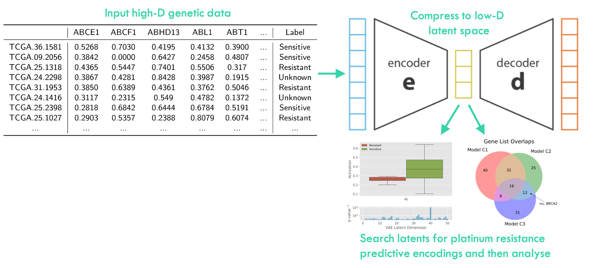

# oVAErian-Cancer 

I use variational autoencoders to efficiently compress ovarian cancer tumour mRNA data in order to search for and extract latent factors, and then gene expressions, highly predictive of platinum chemotherapy resistance. Finally gene enrichment analysis is then used to identify biological processes potentially important in developing platinum resistance, the leading cause of mortality in ovarian cancer patients. 

Full write up can be accessed here: https://www.biorxiv.org/content/10.1101/855593v1 

Submitted in part completion for Part III MSci Degree in physics, University of Cambridge. 

Author: Tom George
Date: June 2019
Correspondence: tomgeorge1@btinternet.com 
To use: [oVAErianCancer.ipynb](./oVAErianCancer.ipynb) gives a walk through of the code and how to use it. 